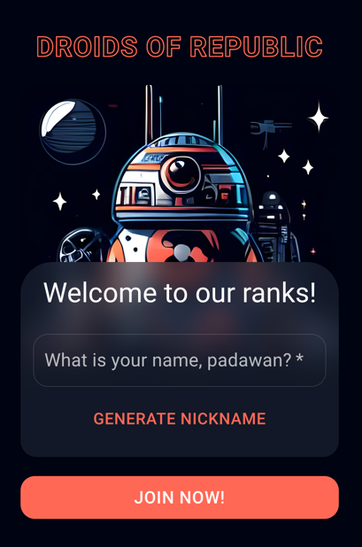
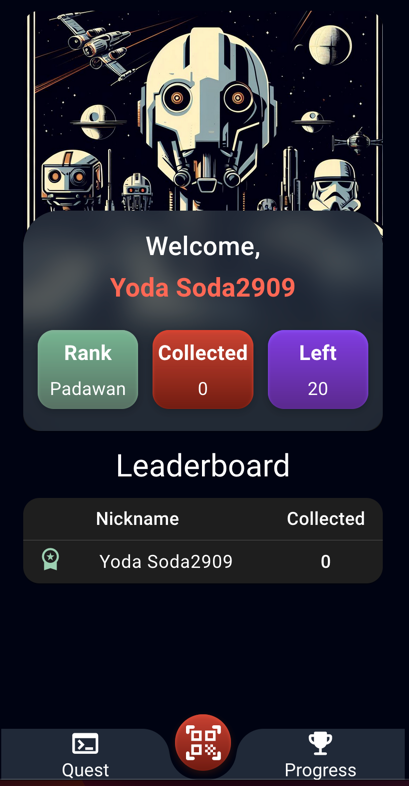
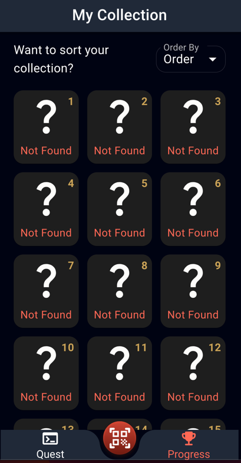

# Droids of Republic

Droids of Republic is a web application that allows users to scan QR codes and find droids from the Star Wars universe. Users can also collect and rank the droids they have scanned and view the global leaderboard of other users.

## Features

- Scan QR codes using your device's camera
- Find droids from Star Wars universe and see their details
- Finish quests droid gives to you
- View the global leaderboard of other users
- Mobile-friendly interface

## Technologies

- Frontend: Vite + React + TypeScript + MUI
- Backend: Kotlin + Spring Boot + MongoDB

## Installation

To run this project, you need to have Node.js, Java, and PostgreSQL installed on your machine.

Clone this repository. You need to have docker cli installed on your machine.

> docker compose run

Open your browser and go to `http://localhost:3000` to see the application

## Usage

To use this application, you need to register your user name. You can use button Generate Nickname or enter your own.

Then, you can scan QR codes by clicking on the scan icon in the navigation bar. You can either use your device's camera or upload an image of a QR code. 

If the QR code contains a valid URL of a droid from the Star Wars API, you will see the details of the droid and have the option to add it to your collection. 

Your rank depends on the amount of droids you've collected. You can view the global leaderboard of other users and their droids by clicking on the leaderboard icon in the navigation bar.

For testing, you can use these QR codes:

